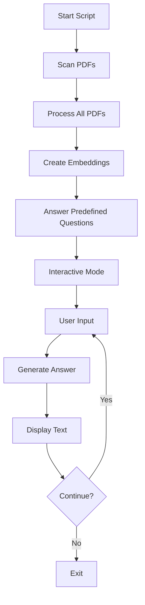
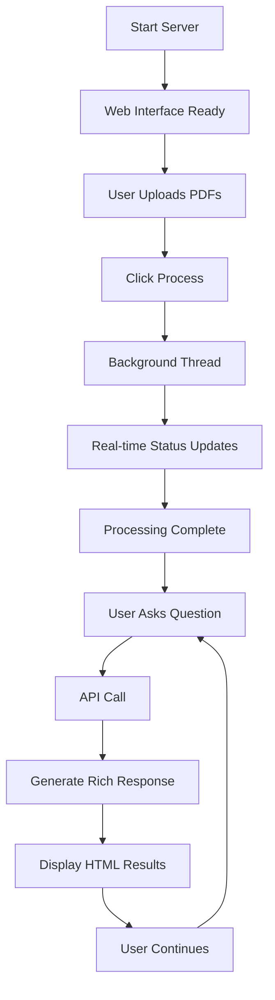

# RAG Pipeline - PDF Question Answering System
## 🔀 Two Versions, Same Power

This project provides a **Retrieval-Augmented Generation (RAG) pipeline** for PDF document analysis and question-answering in **two different interfaces**:

| 💻 **Command Line Version** | 🌐 **Web Interface Version** |
|---|---|
| Traditional CLI experience | Modern web-based interface |
| Direct script execution | Flask web server |
| Terminal-based interaction | Browser-based UI |
| Immediate processing | Background processing with status |
| Simple text output | Rich visual results |

---

## 🚀 Quick Comparison

### ⚡ Command Line Version (`Aufgabe.py`)
```bash
python Aufgabe_CLI.py
# Processes PDFs → Answers questions → Interactive mode
```

### 🌐 Web Interface Version (`Aufgabe.py`)
```bash
python Aufgabe.py
# Starts server → Open browser → Upload PDFs → Ask questions
```

---

## 📊 Feature Comparison Table

| Feature | 💻 CLI Version | 🌐 Web Version | Winner |
|---------|----------------|----------------|---------|
| **Ease of Use** | Technical users | All users | 🌐 Web |
| **Setup Complexity** | Minimal | Requires Flask | 💻 CLI |
| **User Interface** | Text-based | Visual/Interactive | 🌐 Web |
| **Processing Feedback** | Console logs | Real-time progress bar | 🌐 Web |
| **Multiple Users** | Single user | Multi-user capable | 🌐 Web |
| **Background Processing** | Blocking | Non-blocking/Async | 🌐 Web |
| **Result Display** | Plain text | Rich HTML + metadata | 🌐 Web |
| **Resource Usage** | Lower | Higher (Flask overhead) | 💻 CLI |
| **Scriptability** | Excellent | Limited | 💻 CLI |
| **Mobile Access** | None | Responsive web UI | 🌐 Web |

---

## 🔧 Installation & Setup

### Common Dependencies
```bash
pip install PyMuPDF sentence-transformers faiss-cpu numpy
```

### Additional for Web Version
```bash
pip install flask
```

### Project Structure
```
rag-pipeline/
├── 💻 Aufgabe.py          # Command line version
├── 🌐 Aufgabe.py              # Web interface version
├── templates/                  # 🌐 Web only
│   └── index.html
├── static/                     # 🌐 Web only
│   ├── css/
│   └── js/
├── pdfs/                       # 📄 Common: PDF storage
├── *.faiss                     # 💾 Common: Vector indices
└── *_metadata.pkl              # 📊 Common: Metadata
```

---

## 🎯 Usage Comparison

### 💻 Command Line Version

#### Starting the System
```bash
python Aufgabe.py
```

#### Workflow
```
1. 📁 Scans pdfs/ directory
2. 🔄 Processes all PDFs automatically
3. 💾 Creates vector embeddings
4. ❓ Answers 3 predefined questions
5. 💬 Enters interactive Q&A mode
6. ⌨️  Type questions, get text answers
7. 🚪 Type 'quit' to exit
```

#### Example Session
```bash
$ python Aufgabe_CLI.py
Processing PDF files...
Processing: document1.pdf
Processing: document2.pdf
Created 150 text chunks from 2 PDF files
Creating embeddings...
Vector database created successfully!

======================================================================
ANSWERING QUESTIONS
======================================================================

----------------------------------------------------------------------
Question: Wie hoch ist die Grundzulage?

Answer: Based on the analyzed documents:

Based on the documents, relevant amounts mentioned: 175, 185

----------------------------------------------------------------------

======================================================================
INTERACTIVE MODE
======================================================================
You can now ask questions about the documents.
Type 'quit' to exit.

Your question: What about tax treatment?
Answer: Based on the analyzed documents:
...
```

### 🌐 Web Interface Version

#### Starting the Server
```bash
python Aufgabe.py
🚀 Starting RAG Pipeline Web Interface...
📁 Make sure to add your PDF files to the 'pdfs' directory
🌐 Open your browser and go to: http://localhost:8888
⚡ Press Ctrl+C to stop the server
```

#### Web Interface Features

##### 📤 Main Dashboard
```html
┌─────────────────────────────────────────┐
│  RAG Pipeline - PDF Question Answering │
├─────────────────────────────────────────┤
│  📊 Status: 3 PDF files found          │
│  [Process PDFs] [View Status]          │
├─────────────────────────────────────────┤
│  🔍 Ask a Question:                    │
│  [___________________________] [Ask]   │
├─────────────────────────────────────────┤
│  ⚡ Quick Questions:                    │
│  [Q1: Grundzulage] [Q2: Steuerlich]    │
│  [Q3: Direktversicherung]              │
└─────────────────────────────────────────┘
```

##### 📈 Processing Status (Real-time)
```html
┌─────────────────────────────────────────┐
│  🔄 Processing Status                   │
├─────────────────────────────────────────┤
│  Status: Processing...                  │
│  Progress: ████████░░ 80%              │
│  Message: Creating embeddings...        │
│  Time: 45 seconds                       │
└─────────────────────────────────────────┘
```

##### 📋 Rich Results Display
```html
┌─────────────────────────────────────────┐
│  ❓ Question: Wie hoch ist die         │
│     Grundzulage?                        │
├─────────────────────────────────────────┤
│  ✅ Answer:                            │
│  Based on the analyzed documents:       │
│  Relevant amounts mentioned: 175, 185   │
├─────────────────────────────────────────┤
│  📊 Confidence: 0.87                   │
│  📁 Sources: document1.pdf,            │
│             document2.pdf               │
│  🔍 Context: [Expandable section]      │
└─────────────────────────────────────────┘
```

---

## ⚙️ Code Architecture Differences

### 💻 CLI Version Structure
```python
class RAGPipeline:
    # Core RAG functionality
    def process_pdfs(self, pdf_directory):
        # Synchronous processing
        for filename in os.listdir(pdf_directory):
            # Process immediately
            
    def answer_question(self, question):
        # Returns simple string
        return answer_text

def main():
    rag = RAGPipeline()
    rag.process_pdfs("pdfs")
    
    # Predefined questions
    for question in questions:
        answer = rag.answer_question(question)
        print(answer)
    
    # Interactive loop
    while True:
        user_input = input("Your question: ")
        if user_input == 'quit':
            break
        answer = rag.answer_question(user_input)
        print(answer)
```

### 🌐 Web Version Structure
```python
class RAGPipeline:
    # Same core functionality + enhancements
    def process_pdfs(self, pdf_directory, progress_callback=None):
        # Asynchronous processing with callbacks
        if progress_callback:
            progress_callback("Processing file X...")
            
    def answer_question(self, question):
        # Returns rich dictionary
        return {
            'answer': answer_text,
            'sources': source_files,
            'confidence': confidence_score,
            'context': relevant_context
        }

# Flask Web App
app = Flask(__name__)

@app.route('/')
def index():
    # Main web interface
    
@app.route('/process', methods=['POST'])
def process_pdfs():
    # Background processing thread
    
@app.route('/ask', methods=['POST'])
def ask_question():
    # JSON API for questions
    
@app.route('/status')
def get_status():
    # Real-time processing status
```

---

## 🔄 Processing Flow Comparison

### 💻 CLI Version Flow


### 🌐 Web Version Flow


---

## 🚀 Performance Comparison

| Metric | 💻 CLI Version | 🌐 Web Version |
|--------|----------------|----------------|
| **Startup Time** | ~2-3 seconds | ~1 second + browser |
| **Memory Usage** | ~200MB | ~250MB (Flask overhead) |
| **Processing Speed** | Direct/Fast | Same + UI updates |
| **Response Time** | Immediate | ~100ms (network) |
| **Concurrent Users** | 1 | Multiple |
| **CPU Usage** | Lower | Slightly higher |

---

## 📝 When to Use Each Version

### 💻 Choose CLI Version When:
- ✅ You're comfortable with command line
- ✅ Running automated scripts/batch processing
- ✅ Minimal resource usage required
- ✅ Single-user environment
- ✅ Integration with other CLI tools
- ✅ Server/headless environment

### 🌐 Choose Web Version When:
- ✅ Multiple users need access
- ✅ Non-technical users involved
- ✅ Visual interface preferred
- ✅ Remote access required
- ✅ Real-time status monitoring needed
- ✅ Rich result display important

---

## 🛠️ Development & Customization

### 💻 CLI Version Modifications
```python
# Easy to modify for automation
def batch_process_questions(questions_file):
    with open(questions_file) as f:
        questions = f.readlines()
    
    for question in questions:
        answer = rag.answer_question(question.strip())
        print(f"Q: {question.strip()}")
        print(f"A: {answer}\n")

# Add custom output formats
def save_answers_to_json(questions, answers):
    results = dict(zip(questions, answers))
    with open('results.json', 'w') as f:
        json.dump(results, f, indent=2)
```

### 🌐 Web Version Modifications
```python
# Add new API endpoints
@app.route('/api/bulk-questions', methods=['POST'])
def bulk_questions():
    questions = request.json.get('questions', [])
    results = []
    for q in questions:
        result = rag_pipeline.answer_question(q)
        results.append(result)
    return jsonify(results)

# Customize UI templates
@app.route('/dashboard')
def dashboard():
    stats = get_processing_stats()
    return render_template('dashboard.html', stats=stats)
```

---

## 🧪 Testing Both Versions

### 💻 CLI Testing
```bash
# Test CLI version
python Aufgabe_CLI.py

# Expected output:
Processing PDF files...
Created X text chunks from Y PDF files
[Answers to predefined questions]
[Interactive mode starts]
```

### 🌐 Web Testing
```bash
# Test web version
python Aufgabe.py

# Then open browser to http://localhost:8888
# Expected: Web interface loads
# Click "Process PDFs" → Status updates
# Ask questions → Rich results displayed
```

---

## 🔧 Troubleshooting Differences

### 💻 CLI Version Issues
```bash
# Common CLI problems
ImportError: No module named 'sentence_transformers'
→ pip install sentence-transformers

FileNotFoundError: pdfs directory not found
→ mkdir pdfs && add PDF files

KeyboardInterrupt during processing
→ Processing stops, restart needed
```

### 🌐 Web Version Issues
```bash
# Common web problems
Address already in use: Port 8888
→ Change port or kill existing process

Template not found
→ Ensure templates/ directory exists

AJAX request failed
→ Check browser console, server logs
```

---

## 📊 Resource Requirements

### 💻 CLI Version
```
Minimum: 2GB RAM, 1GB storage
Recommended: 4GB RAM, 2GB storage
CPU: Any modern processor
Network: Not required
```

### 🌐 Web Version
```
Minimum: 3GB RAM, 1GB storage
Recommended: 6GB RAM, 2GB storage  
CPU: Multi-core recommended
Network: Required for web access
```

---

## 🎯 Migration Between Versions

### From CLI to Web
```python
# Your existing CLI code works in web version
# Just wrap in Flask routes:

@app.route('/cli-equivalent')
def cli_mode():
    # Run CLI logic
    results = []
    for question in predefined_questions:
        answer = rag.answer_question(question)
        results.append({'question': question, 'answer': answer})
    return jsonify(results)
```

### From Web to CLI
```python
# Extract core logic from web version
def run_cli_mode():
    rag = RAGPipeline()
    rag.process_pdfs('pdfs')
    
    # Use the same answer_question method
    # Just handle the rich response differently
    for question in questions:
        result = rag.answer_question(question)
        print(f"Answer: {result['answer']}")
        print(f"Confidence: {result['confidence']}")
```

---

## 🏆 Conclusion

Both versions offer the **same powerful RAG capabilities** with different user experiences:

### 💻 **CLI Version**: 
- **Best for**: Developers, automation, minimal overhead
- **Strengths**: Simple, fast, scriptable
- **Use case**: Backend processing, integration, technical users

### 🌐 **Web Version**: 
- **Best for**: End users, collaboration, visual feedback
- **Strengths**: User-friendly, multi-user, rich interface
- **Use case**: Interactive analysis, presentations, non-technical users

**Choose based on your audience and use case** - or use both! The core RAG pipeline is identical, so you get the same high-quality results regardless of interface.
